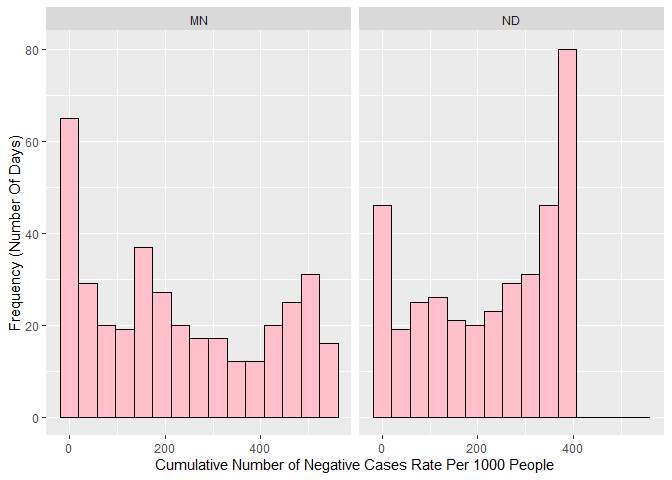
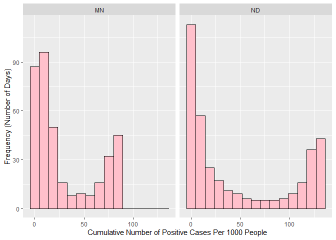
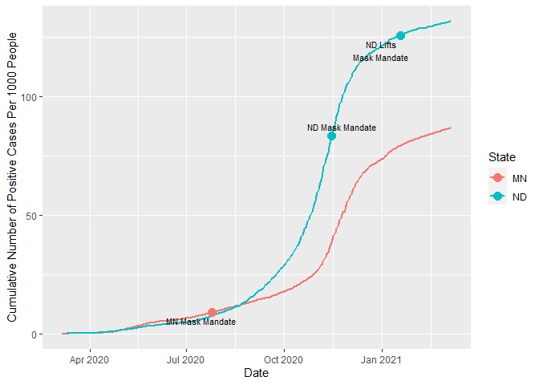

# The Relationship Between State Mandates and the Increase of the Corona Virus

Presentation ID: 4978

Lara Al Selim

Biosciences Department, Minnesota State University Moorhead, 1104 7th
Avenue South, Moorhead, MN 56563 USA

Presented at the MSUM 23rd Online Student Acadmic Conference

Submit a survey for this presentation:
<https://mnstate.co1.qualtrics.com/jfe/form/SV_eFMAwF72JZIoeSq>

## Abstract

The well conversed Corona Virus, SARS-CoV-2, has hit the world at a fast
pace leaving many individuals in a state of distress and panic as it
proceeds to cause mild to moderate respiratory illnesses. Although some
cases are not deadly, many elderly individuals and individuals with
underlying medical illnesses may experience a more severe to deadly
effect from the virus. This infectious virus is known to have been
commonly spread through droplets of saliva or nose discharge when an
infected individual coughs or sneezes. Such droplets are usually subject
to traveling a few feet away from the initial exposure position within a
matter of seconds. Knowing this, a multitude of states have passed
mandates such as the continuous wear of face masks and the spacious
nature of 6 feet apart in hopes of lessening the spread of this virus.
Inquisitive nature has led me to question withier the extremities of
each states’ mandates had an affect on the number of infected
individuals as well as the survival and death rates of the infected. All
of my data will be collected from “The COVID Tracking Project” at The
Atlantic, which is data connected directly from the websites of
state/territory public health authorities. I will be embarking upon
exploratory data analysis from both North Dakota and Minnesota data sets
in order to identify which state had the most incline in cases.This will
then allow me to identify how each states’ mandates had aided in the
prevention of the COVID-19 spread. By identifying the extremities each
state had embarked upon, I will be able to further analyze what
preventative measures were justifiable to lessening the spread of the
Corona Virus.

## Introduction

The well conversed Corona Virus, SARS-CoV-2, has hit the world at a fast
pace leaving many individuals in a state of distress and panic as it
proceeds to cause mild to moderate respiratory illnesses. This
infectious virus is known to have been commonly spread through droplets
of saliva or nose discharge when an infected individual coughs or
sneezes. Such droplets are usually subject to traveling a few feet away
from the initial exposure position within a matter of seconds. Knowing
this, a multitude of states have passed mandates such as the continuous
wear of face masks and the spacious nature of 6 feet apart in hopes of
lessening the spread of this virus. I will be identifying whether the
extremities of each states’ mandates had an effect on the number of
infected individuals. Unfortunately, every state implemented the mask
mandates at different times. Due to these differences, each states COVID
spreading rates have differed.

## Methods

DATA ACQUISITION

All of my data was collected from “The COVID Tracking Project” (Atlantic
covid tracking, 2021) which contains covid data statistics connected
directly from the websites of state/territory public health authorities.
I did not have to request access to view this website, the information
was made public to all those who wanted to view it. In order to
accumulate the data for when the mask mandates were passes and lifted I
had to visit the “Grand Forks Herald” (Turley, 2021) to accumulate the
North Dakota mask mandate and lift dates and “Roseau Northern Minnesota”
(Bain, 2020) to accumulate the Minnesota mask mandate date. I also did
not have to request access to these websites, for they were made public
to all those who wanted to view it. Finally, I gathered the population
of both states from the “United States Census Bureau” (United States
Census Bureau, 2019).

DATA PREPERATION

In this project I used Rstudio (R Core Team, 2021) to clean up and
prepare the COVID data that I have accumulated. First I loaded the
tidyverse package (Wickham et al, 2019) and used the read\_csv function
to load the data into RStudio. From there I began to make my graphs and
rationale my data to fit my base question.

## Results

The histograms are showing the negative and positive COVID case rates
per 1000 people in both North Dakota and Minnesota.

The line graphs are showing the negative and positive COVID case rates
per 1000 people while also showing when the mask mandates were
implemented and lifted in both North Dakota and Minnesota.

<!-- --><!-- --><!-- --><!-- -->

The results show that the implementation of a mask mandate has most
definitely saved lives, for the state that had implemented the mask
mandate for a longer period of time has shown a lower rate of a positive
COVID test score per 1000 people.

## Discussion

Knowing that SARS-CoV-2, also known as the Corona Virus, is commonly
spread through droplets of saliva or nose discharge when an infected
individual coughs or sneezes, the practical decision to make seems to be
taking precautions to distance and cover the mouth and nose at all
times. Unfortunately, these measures were not all implemented at the
same time within every state. The results that I have grasped have
allowed me to narrow my views on the mask mandates implemented by
states. It is clear to see that the state that has held down a mask
mandate for a longer amount of time has ultimately become the “safer
state”. My results have allowed me to compare North Dakota and
Minnesota, in which Minnesota has ultimately came out to be the safer
state. North Dakota had implemented its mask mandate significantly later
than Minnesota on November 14th of 2020 (Turley, 2021), while Minnesota
implemented it on July 25th of 2020 (Bain, 2020). Within this time span,
we are able to see a significant rate at which the positive COVID cases
being reported per 1000 people was somewhat higher in North Dakota then
Minnesota. This data proceeds to grow as we analyze the current day
situation. On January 18th of 2021, North Dakota had completely lifted
its mask mandate (Turley, 2021), while Minnesota had left its mandate
untouched. After the mandate was lifted, there was a significant gap in
the rate amount of positive COVID tests per 1000 people. It is
unfortunate that North Dakota has lifted their mask mandate, for not to
long ago, they had reached record breaking levels of positive COVID
tests. A great precaution to take in the future is clear to eye; in
order to stay safe and healthy one must wear a mask. Although North
Dakota has lifted the mask mandate, people living within that state
could still wear their masks to ensure their safety until a cure has
been processed. I believe that at this point, a mask mandate is exactly
what is needed to ensure the greater populations safety, consequently;
if an individual wants to stay safe during these times they should wear
a mask regardless of their states mandates.

## References

  - R Core Team (2021). R: A language and environment for statistical
    computing. R Foundation for Statistical Computing, Vienna, Austria.
    URL <https://www.R-project.org/>.

  - Wickham et al., (2019). Welcome to the tidyverse. Journal of Open
    Source Software, 4(43), 1686, <https://doi.org/10.21105/joss.01686>

  - The Atlantic COVID, Tracking. “The Covid Tracking Project.” The
    COVID Tracking Project, covidtracking.com/data/\#state-mn.

  - The Atlantic COVID, Tracking. “The Covid Tracking Project.” The
    COVID Tracking Project, covidtracking.com/data/\#state-nd.

\-Bain, Joseph. “MASK MANDATE IMPLEMENTED IN MINNESOTA.” Roseau County
Online, About the Author / Joseph Bain Joseph Bain Is the Owner/Operator
of RoseauOnline.com & WiLD 102 Radio., 23 July 2020,
www.roseauonline.com/mask-mandate-implemented-in-minnesota/\#:\~:text=MASK%20MANDATE%20IMPLEMENTED%20IN%20MINNESOTA%2007%2F23%2F2020%20As%20had,all%20public%20indoor%20spaces%20and%20businesses%2C%20unless%20alone.

\-Turley, Jeremy. “North Dakota’s Statewide Mask Mandate Will Expire
next Week, Burgum Says.” Grand Forks Herald, Grand Forks Herald, 15
Jan. 2021,
www.grandforksherald.com/newsmd/coronavirus/6842585-North-Dakotas-statewide-mask-mandate-will-expire-next-week-Burgum-says\#:\~:text=The%20statewide%20mandate%20originally%20went%20into%20effect%20on,capacity%20created%20the%20need%20for%20a%20mask%20requirement.
